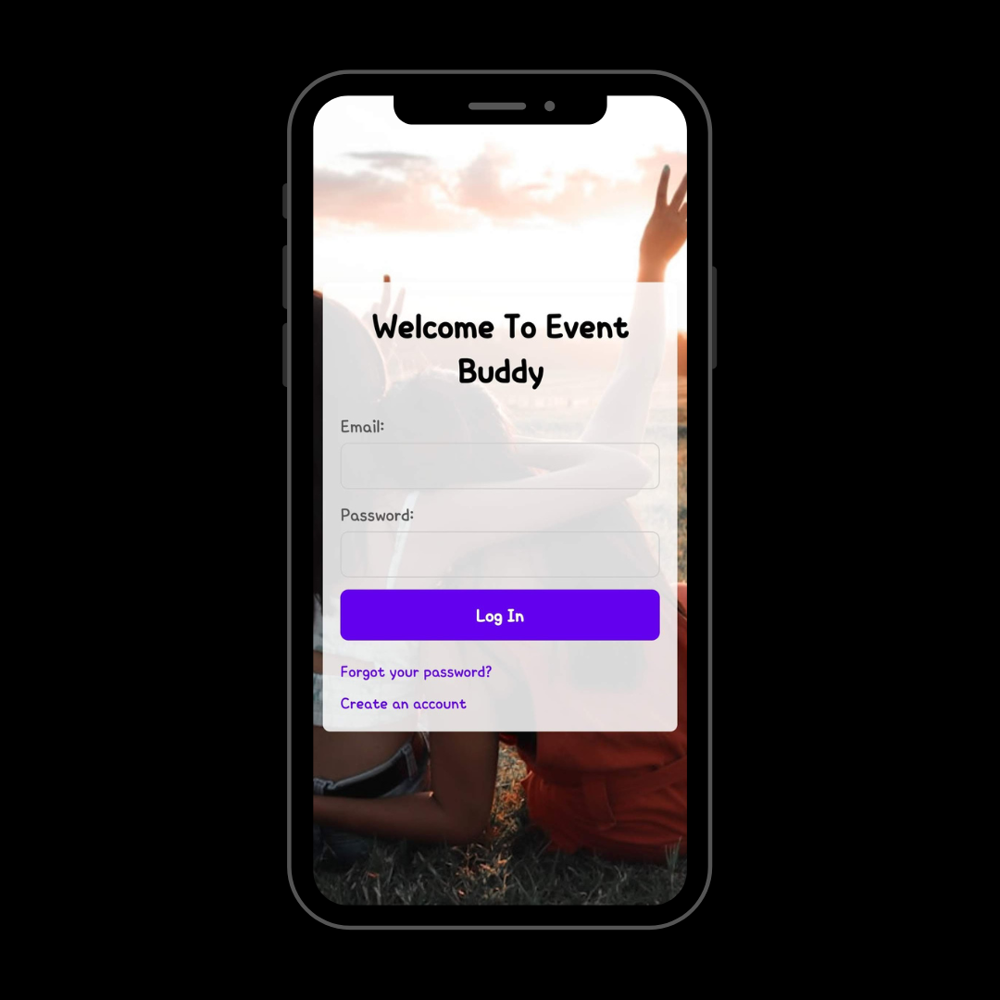
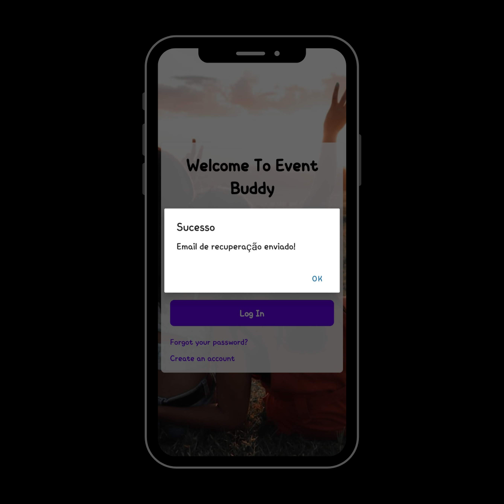
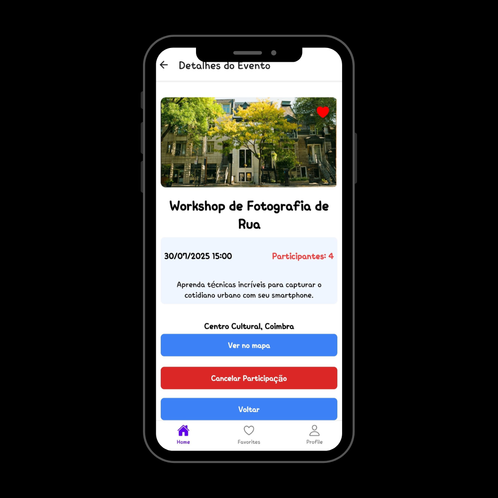
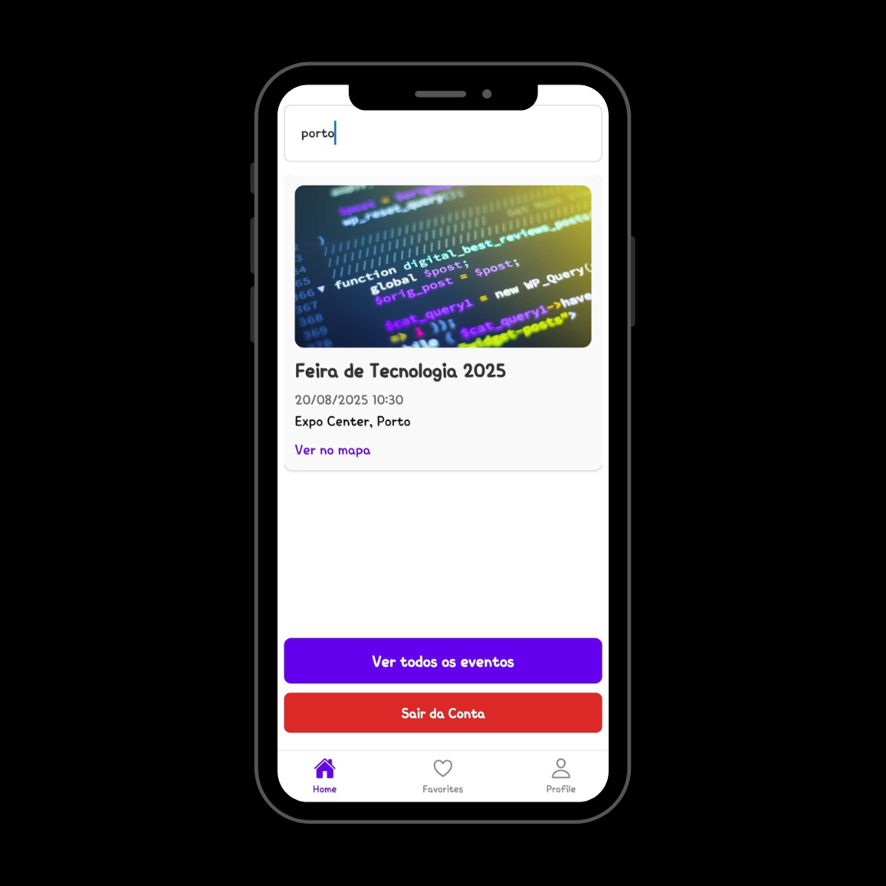
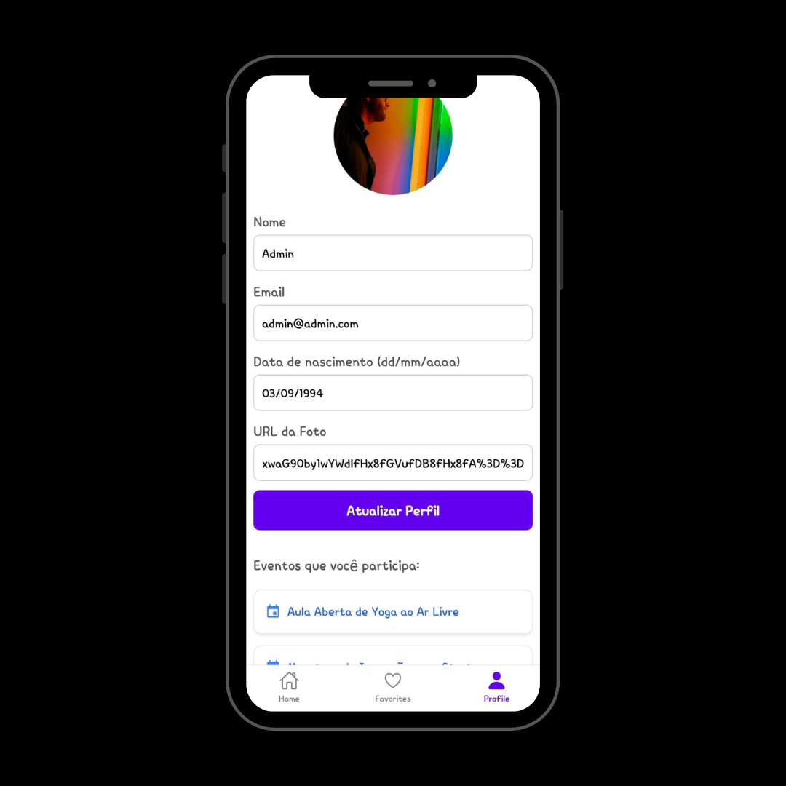
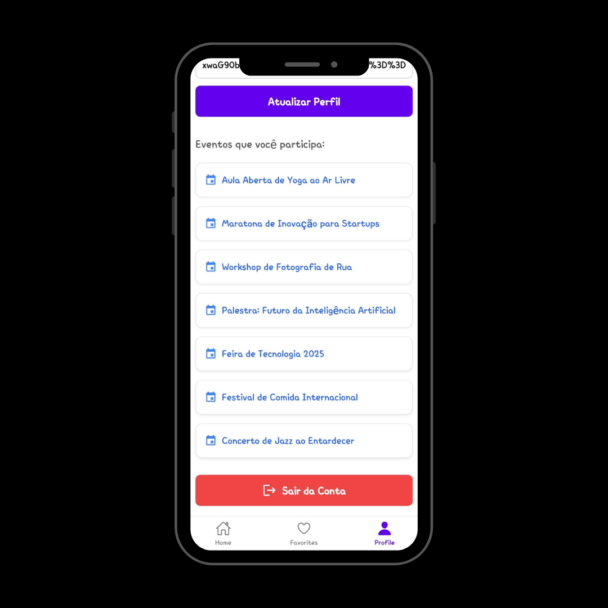

# Event Buddy

Event Buddy is a mobile app built with React Native and Firebase that helps users find, favorite, and participate in local events. Users can sign up, log in, view upcoming events, and manage their profiles with ease.






## ✨ Features

- 📅 Browse and search for upcoming events by title, location, or date
- ❤️ Favorite events to revisit later
- ✅ Join or cancel participation
- 📍 View event location on Google Maps
- 🔐 User authentication (sign up, login, password reset)
- 👤 Profile editing and event participation tracking
- 🔄 Real-time updates using Firebase

## 🧰 Tech Stack

- **React Native (Expo)**
- **Firebase (Auth + Firestore)**
- **React Navigation**
- **Tailwind for React Native (via className)**

## 🚀 Getting Started

### 1. Clone the repository:

```bash
git clone https://github.com/yourusername/event-buddy.git
cd event-buddy
```

### 2. Install dependencies:

```bash
npm install
```

### 3. Run the app:

```bash
npx expo start
```

Make sure to configure your `firebaseConfig.js` with your Firebase credentials.

## 🖼️ Screenshots

| Search | Profile | Profile Events |
|------|----------------|---------|
|  |  |  |

## 📁 Folder Structure

```
assets/
  img/
    home.png
    event-details.png
    profile.png
context/
  AuthContext.js
screens/
  Home.js
  LoginScreen.js
  SignupScreen.js
  Recuperacao.js
  PerfilScreen.js
  EventDetails.js
  Events.js
firebaseConfig.js
App.js
styles.js
```

## 🤝 Contributing

Feel free to fork the project and open pull requests. Bug fixes, improvements, and new features are welcome!

## 📜 License

This project is open source and available under the [MIT License](LICENSE).